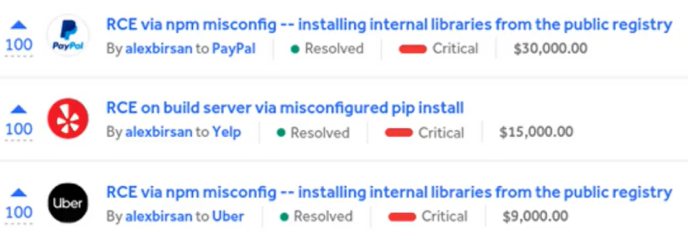

# Dependency Confunsion

**Dependency Confusion**, ou **Confusão de Dependência**, é um tipo de ataque à cadeia de suprimentos de software. Ele explora como os gerenciadores de pacotes (como npm para JavaScript, pip para Python, Maven para Java, etc.) resolvem as dependências de um projeto, especialmente quando uma organização usa tanto repositórios de pacotes públicos (como npmjs.com, PyPI) quanto repositórios privados (para código interno).

#### Exemplos Reais

Um dos casos mais notáveis de ataque de confusão de dependência foi demonstrado em 2021 por Alex Birsan, um pesquisador de segurança. Ele conseguiu invadir os sistemas internos de dezenas de grandes empresas, incluindo Microsoft, Apple e PayPal, ao explorar essa vulnerabilidade. Ele fez isso publicando pacotes de teste benignos com nomes que ele suspeitava serem usados internamente por essas empresas, e muitos de seus sistemas de construção automaticamente baixaram e executaram esses pacotes.

Outros exemplos incluem:

* **Pacotes PyPI maliciosos no ecossistema Python:** Onde versões maliciosas de bibliotecas populares como PyTorch foram plantadas em repositórios públicos.
* **Ataques de typosquatting no npm:** Embora diferente, o typosquatting (onde o atacante usa um nome muito parecido com o original para enganar) pode ser combinado com a confusão de dependência para aumentar as chances de sucesso.

<figure><figcaption></figcaption></figure>



Colocar nas wordlists de fuzzing, pois esses arquivos mostram as dependências que o projeto tem. (leak).

* package.json
* package-lock.json

**Note: Essa vulnerabilidade é mais eficaz em bibliotecas internas e, em alguns casos, permite sobrescrita, dependendo da configuração adotada pela empresa.**



Podemos subir um pacote infectado no nmp ^^, basta criar uma conta&#x20;

